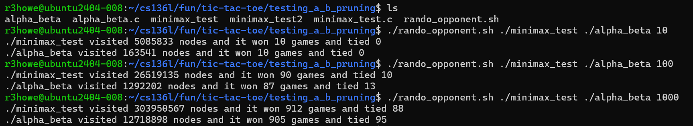
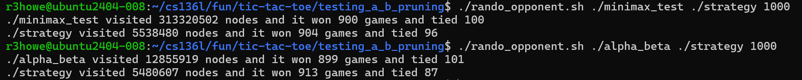
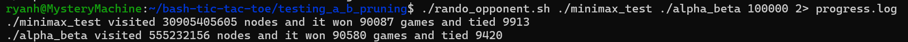

# Unbeatable Optimized Tic-Tac-Toe

An unbeatable Tic-Tac-Toe artificial intelligence built in C, featuring a command-line interface and an automated benchmarking suite written in Bash. 

Wanting to first apply my bash knowledge I had learned in CS136L, I created a bash tic-tac-toe script that someone could play, but it the robot's moves were chosen by random, so I wanted to make it better. I watched https://www.youtube.com/watch?v=STjW3eH0Cik&t=2889s to learn about minimax alpha-beta pruning, and progressive deepening. I first implemented minimax and was curious how fast it was so I created another bash script to see how many nodes it was visiting. It turned out it was quite slow, so I also added in alpha-beta pruning and which ended up being **98.2%** faster. I also used heuristic move-ordering which means it will go down the most promising branches like the center and the corners first allowing it to prune branches quicker.

## Features & Optimizations

* Command Line Interface: You can play against the AI directly in the terminal using a custom Bash script wrapper (it calls another C program for the logic). The bash script also has a random mode, so a person playing might want to switch to this after getting dominated by the minimax algorithm.
* Minimax Decisions: the minimax function evaluates future moves and assigns a value to how good they are.
* Alpha-Beta Pruning: Reduces the time complexity from O(b^d) to a best-case O(b^(d/2)), effectively cutting the computational load by over 95% without changing the bot's win rate (evaluating ~12.7M nodes down from ~303M).
* Move Ordering: Evaluates the board based on optimal Tic-Tac-Toe strategy (Center -> Corners -> Edges) rather than sequentially. This helps with creating a high alpha baseline immediately, allowing the algorithm to prune millions of weaker branches.
* Benchmarking: A Bash testing script utilizing Linux standard error streams (stderr) to execute thousands of head-to-head randomized simulations to help with testing my algos.

## Benchmarks

By combining Alpha-Beta pruning and move ordering, the computational load was reduced by a 98.2% compared to the original brute-force Minimax algorithm.

Standard Minimax vs. Alpha-Beta Pruning:
(~97% reduction in visited nodes)

Alpha-Beta Pruning vs. Alpha-Beta with Move Ordering:
(An additional 57% reduction in visited nodes)

100,000 Game Simulation:
(98.2% better)

## Getting Started

### Installation
First, I used clang/gcc and linux for compiling (so anything similar to this would probably work)

Clone the repository:

    git clone https://github.com/Mr-Methodical/bash-tic-tac-toe.git
    cd bash-tic-tac-toe

### How to Play
To play a game against the AI (or the easy random bot), compile the C engine and run the Bash game script:

    gcc minimax.c -o minimax
    chmod a+x tictactoe.sh
    ./tictactoe.sh

Follow the prompts to choose your difficulty and decide who goes first.

### Running the Benchmarks
To run your own automated simulations and compare the efficiency of the algorithms, navigate to the testing directory:

    cd testing_a_b_pruning
    gcc alpha_beta.c -o alpha_beta
    gcc minimax_test.c -o minimax_test
    chmod a+x rando_opponent.sh
    
Run the simulation (defaults to 100 trials):

    ./rando_opponent.sh ./minimax_test ./alpha_beta 100

## Future Roadmap

* **Smart Move Prioritization:** Right now, the AI always checks the center and corners first. It should be smarter and instead block an opponent who is one move away from winning (potentially adding other weighting as well (so basically have a game board that is dynamically weighted)).
* **Machine Learning:** I want to build a second AI that starts out knowing nothing about Tic-Tac-Toe. It will learn through trial and error by playing thousands of games against the current engine (or itself or the random one). I want to then graph its win rate to show the AI getting smarter over time.
