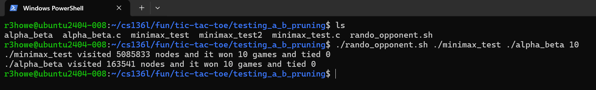

## What I have done so far:
* Created tic-tac-toe that you can run in the command line interface (CLI)
* Implemented an algorithm where the robot's choice would be random using bash shell scripting
* Watched https://www.youtube.com/watch?v=STjW3eH0Cik&t=2889s to learn about minimax algorithm, alpha-beta pruning, and progressive deepening.
* Implement minimax
* Use alpha beta pruning to get the time complexity down from O(b^d) to O(b^d/2) in the best case (and O(b^(3d/4)) in the average case)
* Compared the number of moves to see the average difference the new algorithm made (wrote a bash shell script to test the difference in nodes each visited and the number of wins and ties each had) 
* Put them both against the random version and test over a bunch of trials which one is faster (maybe 1000 games for each)
* Here is image of difference in speed (I sped them up by around 97% less nodes needed to be touched):

## Task still to do:
* Use RL and have the robot play either itself or minimax to learn and create a graph of the learning to show the progress
## Summary:
### Unbeatable Tic-Tac-Toe AI Engine | C, Bash, Git

- Engineered an unbeatable game AI in C, implementing the Minimax decision-making algorithm to evaluate complete game trees and force a win or draw in all scenarios.

- Optimized search efficiency by integrating Alpha-Beta pruning, reducing computational load by 95.8% (evaluating 12.7M nodes vs 303M) without degrading the bot's flawless win rate.

- Designed an automated Bash benchmarking suite utilizing Linux standard error streams (stderr) to execute 1,000+ head-to-head randomized simulations and capture quantitative performance metrics.
